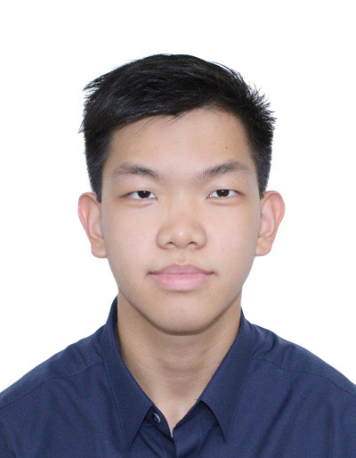

We are a team based in the [School of Computing, National University of Singapore](https://www.comp.nus.edu.sg).

You can reach us at the email `seer[at]comp.nus.edu.sg`

## BizBook

### John Doe

[[homepage](http://www.comp.nus.edu.sg/~damithch)]
[[github](https://github.com/johndoe)]
[[portfolio](team/johndoe.md)]

- Role: Project Advisor

### Jane Doe

[[github](http://github.com/johndoe)]
[[portfolio](team/johndoe.md)]

- Role: Team Lead
- Responsibilities: UI

### Johnny Doe

[[github](http://github.com/johndoe)] [[portfolio](team/johndoe.md)]

- Role: Developer
- Responsibilities: Data

### Then Kai Hsien

[[github](http://github.com/romidas99)]
[[portfolio](team/johndoe.md)]

- Role: Scheduling and tracking
- Responsibilities: In charge of defining, assigning, and tracking project tasks

### Kelvin Cai Wang

[[github](http://github.com/caiwang0)]
[[portfolio](team/johndoe.md)]

- Role: Developer
- Responsibilities: UI
