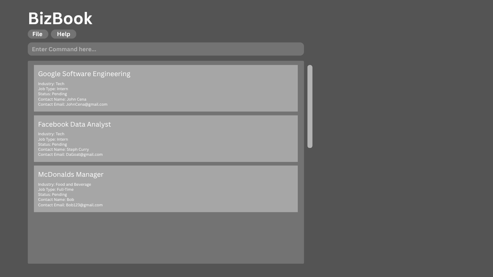

BizBook is a **desktop app for managing job applications, optimized for use via a Command Line Interface** (CLI) while still having the benefits of a Graphical User Interface (GUI). If you can type fast, BizBook can get your contact management tasks done faster than traditional GUI apps.

* Table of Contents
{:toc}

--------------------------------------------------------------------------------------------------------------------

## Quick start

1. Ensure you have Java `17` or above installed in your Computer. 
   **Mac users:** Ensure you have the precise JDK version prescribed [here](https://se-education.org/guides/tutorials/javaInstallationMac.html).

1. Download the latest `.jar` file from [here](https://github.com/AY2526S1-CS2103T-T10-1/tp/).

1. Copy the file to the folder you want to use as the _home folder_ for your AddressBook.

1. Open a command terminal, `cd` into the folder you put the jar file in, and use the `java -jar BizBook.jar` command to run the application. 
   A GUI similar to the below should appear in a few seconds. Note how the app contains some sample data. 
   

1. Type the command in the command box and press Enter to execute it. e.g. typing **`help`** and pressing Enter will open the help window. 
   Some example commands you can try:

   * `list` : Lists all internship applications.

   * `add n/Google i/Technology a/SWE Intern t/Backend microservices e/careers@google.com s/Saved` : Adds a Google application.

   * `edit 1 s/Interviewing` : Edits the 1st application's status to "Interviewing".

   * `delete 3` : Deletes the 3rd application shown in the current list.

   * `clear` : Deletes all applications.

   * `exit` : Exits the app.

1. Refer to the [Features](#features) below for details of each command.

--------------------------------------------------------------------------------------------------------------------

## Features

**:information_source: Notes about the command format:** 

* Words in `UPPER_CASE` are the parameters to be supplied by the user. 
  e.g. in `add n/COMPANY_NAME`, `COMPANY_NAME` is a parameter which can be used as `add n/Google`.

* Extraneous parameters for commands that do not take in parameters (such as `help`, `list`, `exit` and `clear`) will be ignored. 
  e.g. if the command specifies `help 123`, it will be interpreted as `help`.

* Items in square brackets are optional. 
  e.g `edit INDEX [n/COMPANY_NAME] [i/INDUSTRY] [a/JOB_TYPE] [e/EMAIL] [t/DESCRIPTION] [s/STATUS]` can be used with or without the description.

* If you are using a PDF version of this document, be careful when copying and pasting commands that span multiple lines as space characters surrounding line-breaks may be omitted when copied over to the application.

### Viewing help : `help`

Shows a message explaining how to access the help page.

Format: `help`

### Adding an application: `add`

Adds a new internship application to BizBook.

Format: `add n/COMPANY_NAME i/INDUSTRY a/JOB_TYPE t/DESCRIPTION e/EMAIL s/STATUS`

Notes:
- `INDUSTRY` must be one of: Technology, Finance, Consulting, Healthcare, Marketing, Operations, Graphic Design
- `STATUS` must be one of: Saved, Applied, Interviewing, Offer, Rejected.

Examples:
* `add n/Google i/Technology a/SWE Intern t/Backend microservices e/careers@google.com s/Saved`
* `add n/DBS Bank i/Finance a/Data Analyst Intern t/Analytics team e/internships@dbs.com s/Applied`

### Listing all applications : `list`

Shows a list of all internship applications in BizBook.

Format: `list`

### Editing an application : `edit`

Edits the details of an existing internship application.

Format: `edit INDEX [n/COMPANY_NAME] [i/INDUSTRY] [a/JOB_TYPE] [e/EMAIL] [t/DESCRIPTION] [s/STATUS]`

Notes:
* Edits the application at the specified `INDEX` (as shown in the current list). The index is **1-based**.
* At least one field to edit must be provided.
* Existing values will be overwritten by the new inputs.
* Input for `INDUSTRY` and `STATUS` is case-insensitive (e.g., `i/technology` and `s/applied` are accepted).

Examples:
* `edit 1 n/Google Singapore`
* `edit 2 s/Interviewing`
* `edit 3 a/Quant Intern t/Global Markets desk`

### Deleting an application : `delete`

Deletes the specified internship application.

Format: `delete INDEX`

* Deletes the application at the specified `INDEX`.
* The index refers to the number shown in the current list.
* The index **must be a positive integer** 1, 2, 3, …​

Examples:
* `list` followed by `delete 2` deletes the 2nd application in the list.
* `find Google` followed by `delete 1` deletes the 1st application in the search results.

### Clearing all entries : `clear`

Clears all entries from BizBook.

Format: `clear`

### Exiting the program : `exit`

Exits the program.

Format: `exit`

### Saving the data

Data are saved to disk automatically after any command that changes data. There is no need to save manually.

### Editing the data file

Data are saved automatically as a JSON file `[JAR file location]/data/addressbook.json`. Advanced users may edit that file directly.

:exclamation: **Caution:**
If your changes to the data file makes its format invalid, the app will discard all data and start with an empty data file at the next run. Always back up the file before editing it. 
Furthermore, certain edits can cause the app to behave in unexpected ways (e.g., invalid values). Edit the data file only if you are confident you can update it correctly.

### Mark most interested internship roles `[coming in v2.0]`

_Details coming soon ..._

--------------------------------------------------------------------------------------------------------------------

## FAQ

**Q**: How do I transfer my data to another Computer? 
**A**: Install the app in the other computer and overwrite the empty data file it creates with the file that contains the data of your previous AddressBook home folder.

--------------------------------------------------------------------------------------------------------------------

## Known issues

1. **When using multiple screens**, if you move the application to a secondary screen, and later switch to using only the primary screen, the GUI will open off-screen. The remedy is to delete the `preferences.json` file created by the application before running the application again.
2. **If you minimize the Help Window** and then run the `help` command (or use the `Help` menu, or the keyboard shortcut `F1`) again, the original Help Window will remain minimized, and no new Help Window will appear. The remedy is to manually restore the minimized Help Window.

--------------------------------------------------------------------------------------------------------------------

## Command summary

Action | Format, Examples
--------|------------------
**Add** | `add n/COMPANY_NAME i/INDUSTRY a/JOB_TYPE t/DESCRIPTION e/EMAIL s/STATUS`   e.g., `add n/Google i/Technology a/SWE Intern t/Backend microservices e/careers@google.com s/Saved`
**Clear** | `clear`
**Delete** | `delete INDEX`  e.g., `delete 3`
**List** | `list`
**Edit** | `edit INDEX [n/COMPANY_NAME] [i/INDUSTRY] [a/JOB_TYPE] [e/EMAIL] [t/DESCRIPTION] [s/STATUS]`  e.g.,`edit 2 s/Interviewing` 
**Help** | `help`
